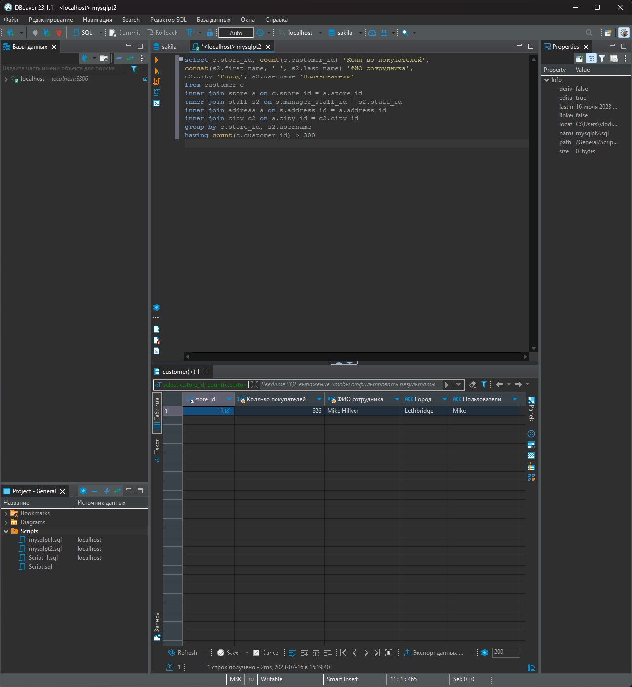

# «SQL. Часть 2» | 'Бойко Владислав'
---
## Задание 1
В целом надеюсь правильно понял задание, на счет пользователей неуверен, почему-то если count использовать то возвращает число равное customers. Можно конечно подзапрос написать, но думаю причина другная

```mysql
select c.store_id, count(c.customer_id) 'Колл-во покупателей', 
concat(s2.first_name, ' ', s2.last_name) 'ФИО сотрудника', 
c2.city 'Город', s2.username 'Пользователи'
from customer c
inner join store s on c.store_id = s.store_id 
inner join staff s2 on s.manager_staff_id = s2.staff_id 
inner join address a on s.address_id = a.address_id 
inner join city c2 on a.city_id = c2.city_id 
group by c.store_id, s2.username 
having count(c.customer_id) > 300
```

Вроде видно должно быть.
---
## Задание 2
Вроде что-то как-то так

```mysql
select count(title)
from film 
where `length` > (select avg(`length`) from film)
```
---
## Задание 3
Ну вроде бы как-то так, хоть в базе и 2 года по дате, но месяца не повторяются

```mysql
SELECT MONTH(p.payment_date) 'Месяц', SUM(p.amount) 'Сумма платежей', 
count(r.rental_id) 'Колл-во аренд в месяце' 
FROM payment p
inner join rental r on p.rental_id = r.rental_id 
GROUP BY MONTH(p.payment_date), month(r.rental_date)
order by SUM(p.amount) desc
limit 1
```
---
## 
---
## 
---
## 
---
## 
---