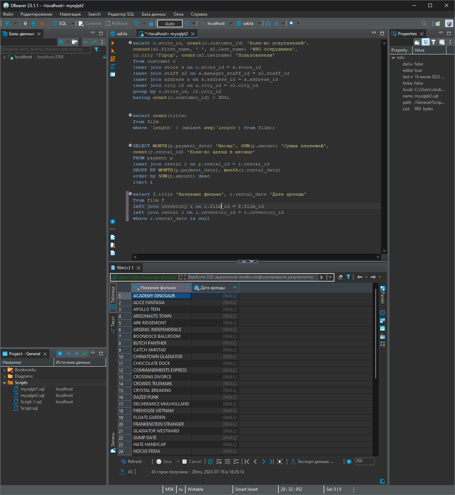

# «SQL. Часть 1» | "Бойко Владислав"
---
## Задание 1
Хоть убей не пойму как исключить пробелы

Есть вот два запроса, как их сенергировать не знаю даже, пробывал and в разных последовательностях и эпостасях ниче не выходит, посоветовали not like 'K%a[^ ]' тоже не помогло.
```mysql
SELECT distinct district
FROM address
where district like "K%a"
```
```mysql
SELECT distinct district
FROM address
where district not like "% %"
```
Запрос выдает пустоту: 
```mysql
SELECT distinct district
FROM address
where district <> "% %" and district = 'K%a'
```
Получилось:
```mysql
SELECT distinct district
FROM address
where district like 'K%a' and district not like '% %';
```

---
## Задание 2
Вот так как-то

```mysql
select amount
from payment 
where amount > '10.00' and payment_date between '2005-06-15' and '2005-06-18'
```
Исправил

```mysql
select *
from payment 
where amount > '10.00' and payment_date between '2005-06-15' and '2005-06-19'
order by payment_date 
```
---
## Задание 3
Вот так как-то

```mysql
select rental_date, rental_id, inventory_id 
from rental	
order by rental_date desc
limit 5
```
---
## Задание 4
Вот так как-то

```mysql
select lower(replace(first_name, 'L', 'P')), lower(replace(last_name , 'L', 'P'))  
from customer
where first_name = 'Kelly' or first_name = 'Willie' and active = '1'
```
---
## Задание 5
Пытался как то с помощью right сделать, но не вышло, возможно что то не так прописываю, но вообще такое решение тоже работает, хоть и костыльно

```mysql
select substring_index(email, '@', 1), right(email, 18)
from customer 
```
---
## Задание 6
Чет не выходит
---  